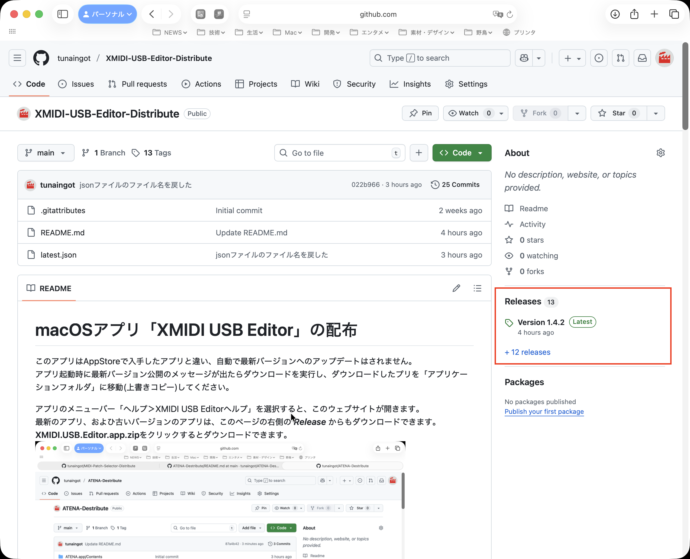
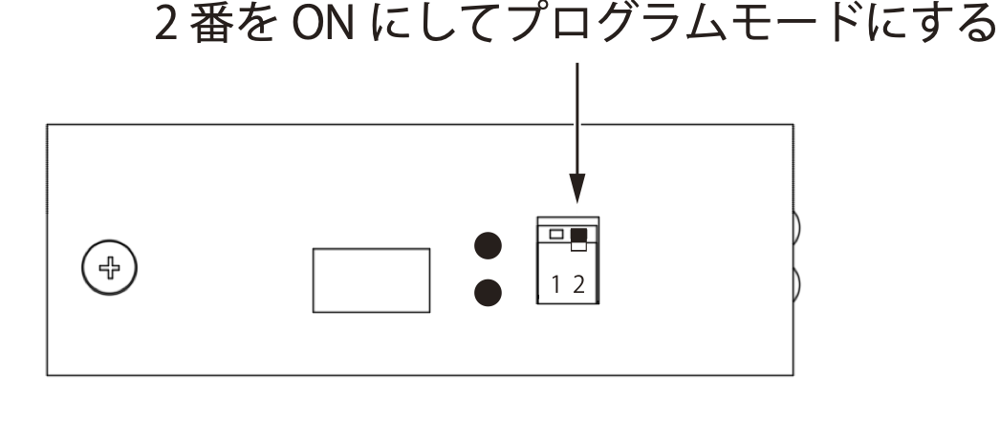
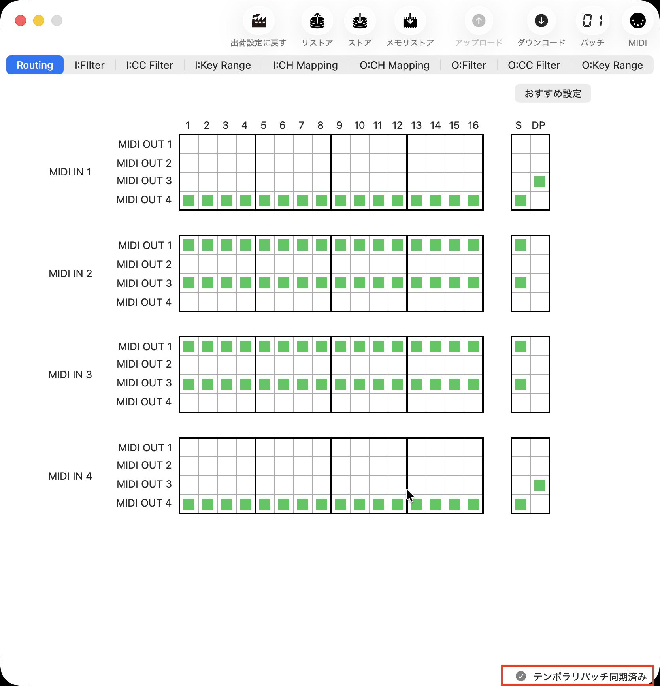
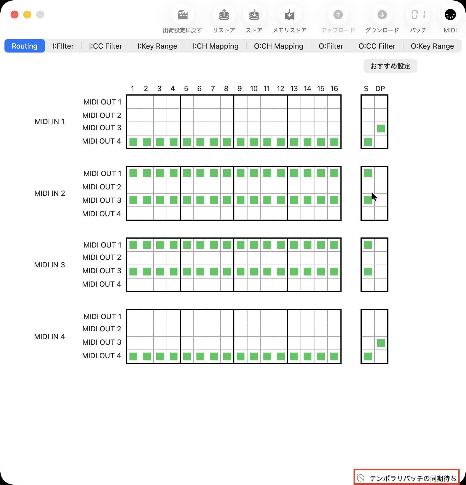
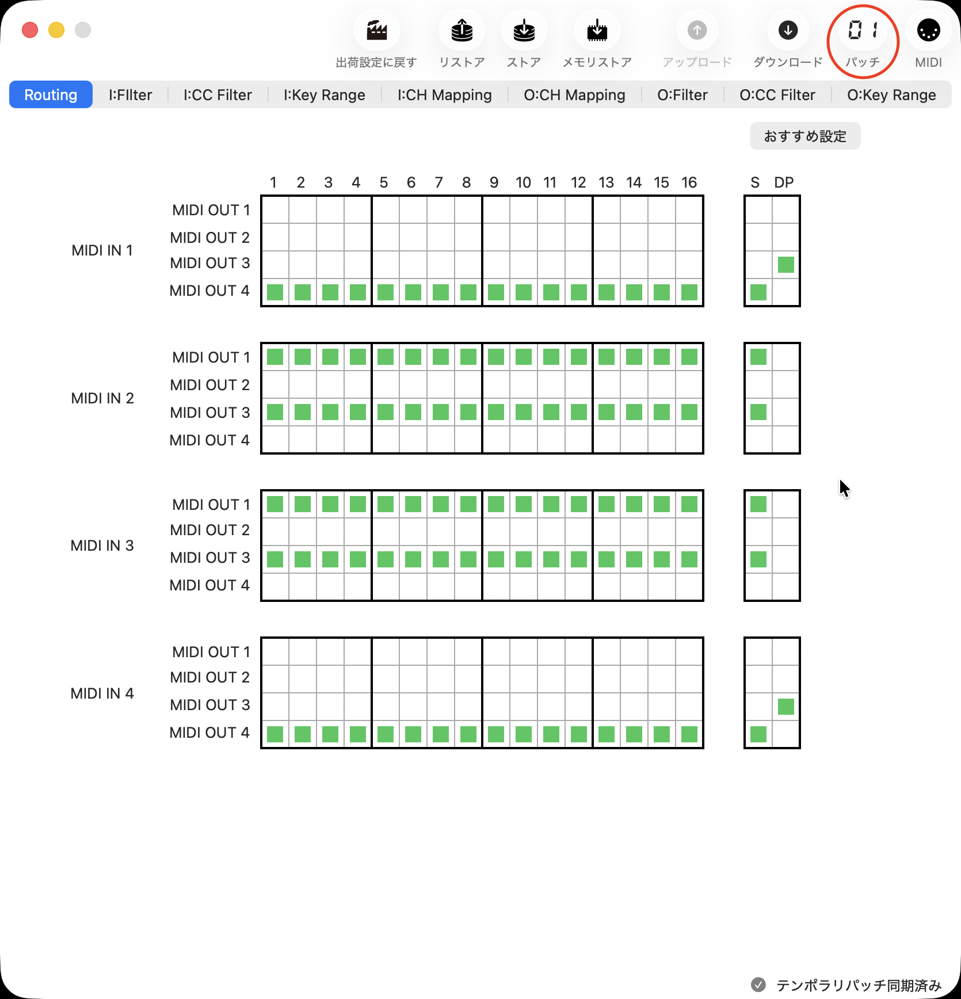
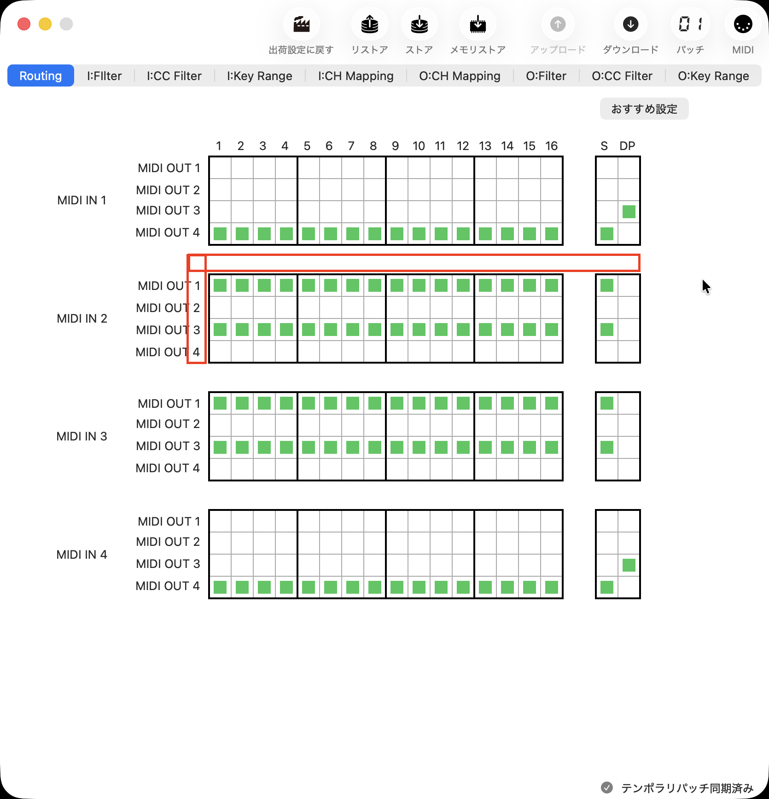
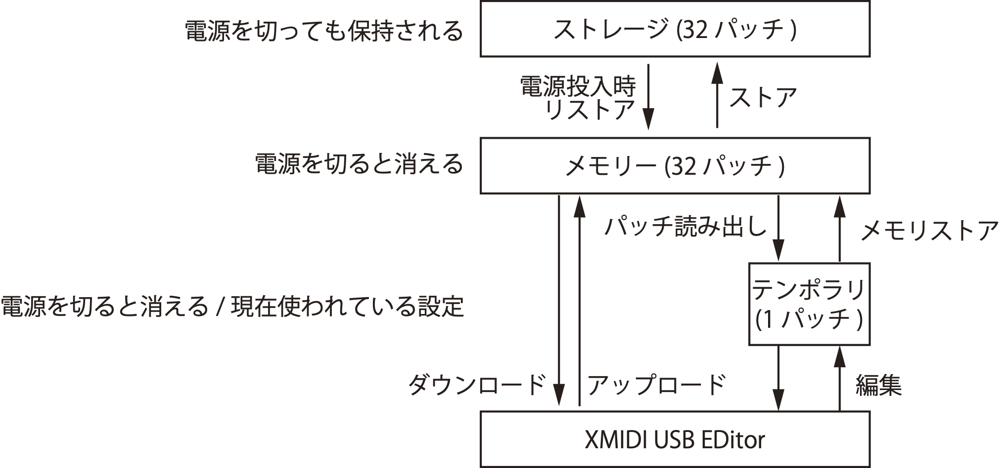
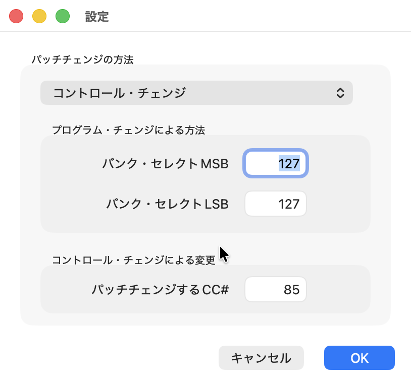

# macOSアプリ「XMIDI USB Editor」の配布
このアプリはAppStoreで入手したアプリと違い、自動で最新バージョンへのアップデートはされません。\
アプリ起動時に最新バージョン公開のメッセージが出たらダウンロードしてください。\
ダウンロードしたアプリは、「アプリケーションフォルダ」に移動(上書きコピー)してください。

アプリのメニューバー「ヘルプ＞XMIDI USB Editorヘルプ」を選択すると、このウェブサイトが開きます。\
最新のアプリ、およひ古いバージョンのアプリは、このページの右側の ***Release*** からもダウンロードできます。\
リリースのページで、「**XMIDI.USB.Editor.app.zip**」をクリックするとダウンロードできます。

# 動作環境
- 対応OS：macOS 13.5以上
- 配布形式：Appleのノータリゼーションを受けたカスタマーダイレクト配布
- XMIDI4 USBがMacに接続されていること

# XMIDI4 USBのプログラムモード
XMIDI USB Editorはプログラムモードで使う場合の設定を編集するアプリです。\
XMIDI4 USBをプログラムモードにするには、側面ディップスイッチの2番をONにします。

# アプリの起動と初期状態
XMIDI4 USBをMacに接続した状態でXMIDI USB Editorを起動すると、即座に現在選択されているパッチが画面に反映されます。\
その際、ウィンドウ右下に「テンポラリパッチ同期済み」と表示されます。

XMIDI4 USBを後からMacに接続した場合、Macが接続を検出するとパッチが画面に反映されます。\
それまでは、ウィンドウ右下が「テンポラリパッチの同期待ち」と表示されます。

ウィンドウのツールバー領域には、現在選択されているパッチの番号が表示されます。

# 設定データの編集
緑色のチェックが付いているものが通過するデータ、チェックが付いていないものはミュートされるデータです。\
項目、チャンネル個別に設定ができます。\
設定項目のマスの中をマウスでクリックすると、チェックの入/切ができます。\
この変更は即座にUSBでXMIDI4 USBへ送られ、設定が反映されます。

表の外側をクリックすると、行、列をまとめてチェックの入/切ができます。\
表の外側の角をクリックすると、表内すべてのチェックの入/切ができます。

# XMIDI4 USBのメモリ構成
XMIDI USB Editorの画面で編集しているのはテンポラリパッチです。\
編集中のパッチをメモリストアすると、メモリーの中に保存されます。\
ストレージへのストアはすべての作業が終わってから実行するといいでしょう。

# XMIDI4 USBの個別設定
XMIDI4 USBのパッチは

- バンク・セレクトを併用したプログラム・チェンジ
- 指定したコントロールチェンジ

で選択することができます。
その設定は「XMIDI USB Editor>設定...」メニューで行います。\
デフォルトでは

- プログラム・チェンジ、コントロール・チェンジ両方でパッチを選択する
- バンク・セレクトMSB：127
- バンク・セレクトLSB：127
- コントロール・チェンジ：85

になっています。\
構成する楽器類のシステムに合わせて、自由に変更可能です。

# ダウンロード/アップロード
32あるパッチデータをダウンロードし、ファイルとして保存しておくことができます。\
また、ファイルをアップロードすると、メモリの内容をすべてアップローしたファイルで置き換えます。\
パッチのバックアップなどに利用してください。

# 工場出荷に戻す
すべての設定をデフォルトに戻すことができます。
